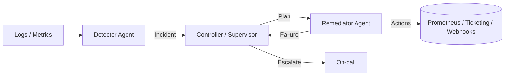

# ITOps AutoFix Agent (Event-Driven, Self-Healing, Runbooks)

A **contract-to-hire–ready** prototype showing how an **Agentic AI** can detect incidents,
decide remediation using **runbook policies**, and execute actions with retries & escalation.

## 🧩 Architecture



- **Detector Agent**: consumes events (Kafka-like **in-memory EventBus** in this prototype) and recognizes incidents.
- **Controller**: classifies severity, selects a **runbook** and **plans** steps.
- **Remediator**: executes actions (scale, restart, clear cache) and implements **self-healing retries**.

## 🛠️ Tech Stack
- Python 3.10+
- `pyyaml`, `requests`, `tqdm`
- Optional integrations: Prometheus-like API client (mock provided)

## 🚀 Quickstart

```bash
python -m venv .venv && source .venv/bin/activate
pip install -r requirements.txt

# run simulation
python src/main.py --simulate
```

## 🧪 What It Demonstrates
- Event-driven design (producer/consumer on a simple bus)
- Policy-driven remediation (YAML runbooks)
- Backoff + retries + failover to human escalation
- Clean separation of **detector / controller / remediator**

## 📦 Structure

```
itops-autofix-agent/
├─ src/
│  ├─ main.py
│  ├─ bus/event_bus.py
│  ├─ agents/
│  │  ├─ detector.py
│  │  ├─ controller.py
│  │  └─ remediator.py
│  └─ integrations/prometheus_client.py
├─ policies/runbook.yaml
├─ tests/test_pipeline.py
├─ requirements.txt
├─ LICENSE
└─ README.md
```

---

**License:** MIT
